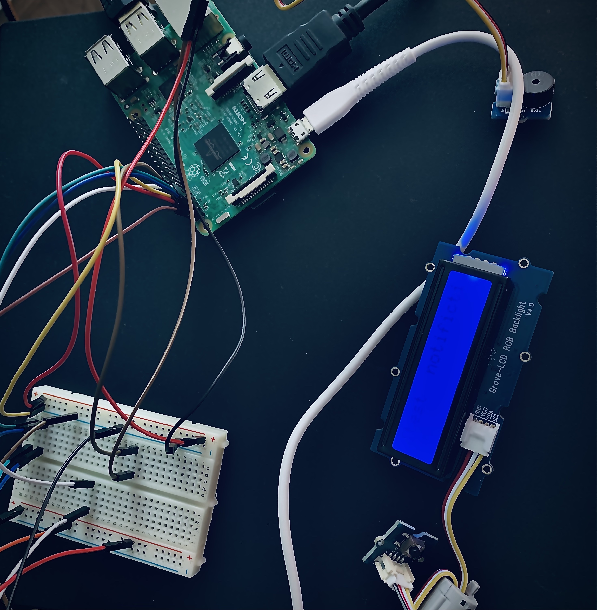
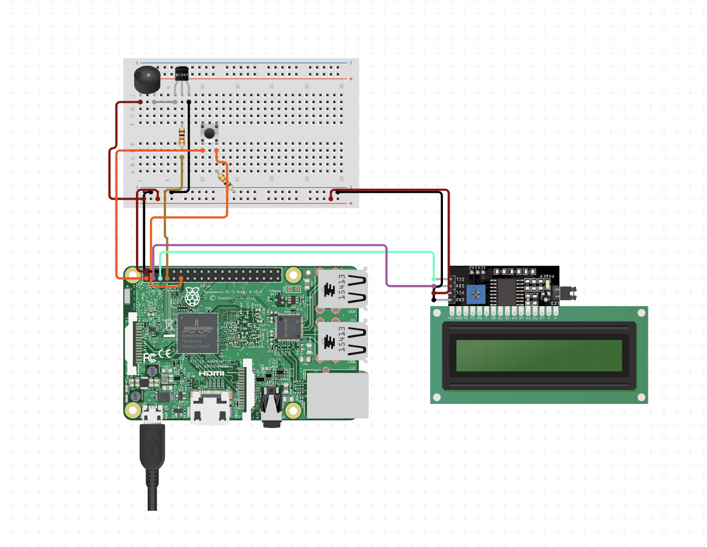

# Raspberry Pi IoT Pager

The Raspberry Pi IoT Pager is a small project that simulates a pager using a Raspberry Pi and various hardware components. The pager receives notifications from a remote server and displays them on an RGB LCD display using custom graphics and animations.

# Description

The Raspberry Pi IoT Pager is a fun and useful project that demonstrates the power and flexibility of the Raspberry Pi platform. The pager can be used in a variety of scenarios, such as receiving notifications from a smart home system, monitoring server status, or as a novelty item for your desk.

# Demo


# Screenshot



# Diagram



# Pre-requisites

- **Raspberry Pi Model 3**: This is the main component of the project, and it serves as the central processing unit for the system.

- **Grove RGB LCD**: You will need a Grove RGB LCD display that is compatible with the Raspberry Pi and uses an I2C interface. There are various models available, but you should choose one that matches the size and resolution requirements of your project.

- **Grove Buzzer**: You will need a Grove buzzer module that is compatible with the Raspberry Pi and can produce sound.

- **Grove Button**: You will need a Grove button module that is compatible with the Raspberry Pi and can detect button presses.

- **Jumper Cables**: You will need jumper cables to connect the various components together.

- **Breadboard**: You will need a breadboard to connect the components together and to provide power to the system.

- **I2C Interface**: To connect the Grove RGB LCD display to the Raspberry Pi, you will need an I2C interface module. This module will allow the Raspberry Pi to communicate with the LCD display using the I2C protocol.

- **Power Supply**: The Raspberry Pi Model 3 requires a power supply that can deliver 5 volts and at least 2 amps. You can use a standard USB power supply, but make sure it meets the minimum requirements.

- **MicroSD Card**: The Raspberry Pi Model 3 requires a microSD card to store the operating system and project files. You will need a microSD card with at least 8GB of storage capacity.

- **HDMI Cable**: You will need an HDMI cable to connect the Raspberry Pi to a monitor or TV for setup and testing.

- **Keyboard and Mouse**: You will need a keyboard and mouse to interact with the Raspberry Pi during setup and testing.

# Configuration

1. Installing Python dependencies

To run the pager project, you will need to install the following Python dependencies:

```bash
$ sudo apt-get update
$ sudo apt-get install python3-pip python3-dev
$ sudo pip3 install paho-mqtt
```

2. Setting up Mosquitto

Mosquitto is an open-source message broker that implements the MQTT protocol. You can install Mosquitto on the Raspberry Pi 3 by running the following commands:

```bash
$ sudo apt-get update
$ sudo apt-get install mosquitto mosquitto-clients
```

3. Enabling Mosquitto protocol through websockets on port 1884 0.0.0.0

To enable Mosquitto protocol through websockets on port 1884 0.0.0.0, you need to modify the Mosquitto configuration file. Follow the steps below:

1. Open the Mosquitto configuration file using a text editor:

```
$ sudo nano /etc/mosquitto/mosquitto.conf
```

2. Add the following lines to the end of the file:

```yaml
listener 1884
protocol websockets
allow_anonymous true
bind_address 0.0.0.0
```

This configuration will enable Mosquitto to listen on port 1884 for WebSocket connections and allow anonymous connections from any IP address.

3. Save and close the file by pressing `CTRL+X`, then `Y`, and then `ENTER`

4. Restart Mosquitto to apply the changes:

```bash
$ sudo systemctl restart mosquitto
```

Now Mosquitto is configured to accept WebSocket connections on port 1884 from any IP address. You can test the configuration by running a WebSocket client and connecting to `ws://<raspberry_pi_ip_address>:1884/`.
